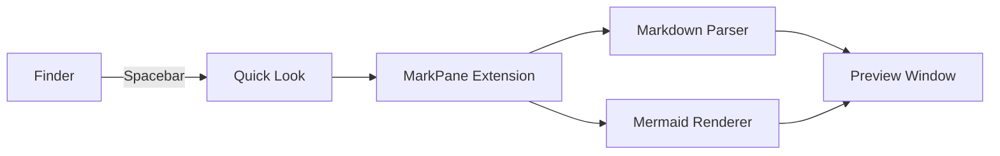

# Architecture Overview

MarkPane provides instant markdown preview directly in macOS Finder.

## System Flow



## Features

- **GitHub-style rendering** with syntax highlighting
- **Mermaid diagrams** auto-rendered as SVG
- **PDF export** via CLI: `markpane file.md --pdf out.pdf`
- **Theme-aware** — follows macOS light/dark mode

## Quick Start

```bash
# View a file
yarn start -- ./README.md

# Export to PDF
yarn start -- ./README.md --pdf output.pdf
```
