# Welcome to MarkPane 🚀

Your markdown, beautifully rendered with a single spacebar press.

## What You're Seeing

This demo showcases everything markpane can do:

### Code Highlighting

**Python** — clean and readable:
```python
def fibonacci(n: int) -> list[int]:
    sequence = [0, 1]
    for _ in range(n - 2):
        sequence.append(sequence[-1] + sequence[-2])
    return sequence
```

**JavaScript** — modern ES6:
```javascript
const debounce = (fn, ms) => {
  let timeout;
  return (...args) => {
    clearTimeout(timeout);
    timeout = setTimeout(() => fn(...args), ms);
  };
};
```

### Mermaid Diagrams

```mermaid
graph TD
    A[📄 Markdown File] --> B{Quick Look?}
    B -->|Spacebar| C[🎨 Rendered Preview]
    B -->|CLI| D[markpane file.md]
    D --> C
    D --> E[📑 PDF Export]
    C --> F[✨ Beautiful Output]
    E --> F
```



### Tables

| Feature | Electron App | Quick Look |
|---------|:------------:|:----------:|
| Markdown rendering | ✓ | ✓ |
| Mermaid diagrams | ✓ | ✓ |
| Syntax highlighting | ✓ | ✓ |
| Theme support | ✓ | ✓ |
| PDF export | ✓ | — |

### Lists & Formatting

What makes markpane special:
- **Zero friction** — spacebar preview, no app launch
- **Native feeling** — follows your system theme
- **Developer friendly** — CLI for automation

> "The best tool is the one you don't notice using."

### Task Lists

Project checklist:
- [x] Markdown rendering
- [x] Mermaid diagrams
- [x] Syntax highlighting
- [ ] Plugin system
- [ ] Collaborative editing

### Strikethrough

~~Old approach~~ → **New approach**

Text with ~~deleted content~~ and corrections.

### Auto-linking

Visit the project: https://github.com/starfysh-tech/markpane

---

*Rendered by markpane • [GitHub](https://github.com/starfysh-tech/markpane)*
