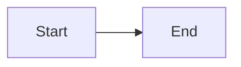

# Peekdown Comprehensive Test Suite

Quick validation of all 8 roadmap sessions in one file.

## Session 1: Syntax Highlighting

```javascript
const greet = (name) => `Hello, ${name}!`;
```

```python
def fibonacci(n):
    return n if n <= 1 else fibonacci(n-1) + fibonacci(n-2)
```

## Session 2: Task Lists & GFM

- [x] Completed task
- [ ] Pending task
  - [x] Nested completed
  - [ ] Nested pending

~~Strikethrough~~ and https://github.com linkify test.

Smart "quotes" and 'apostrophes' -- with ellipsis...

## Session 3: Pin Feature

**Manual:** Press `Cmd+Shift+P` to toggle pin.

## Session 4: Window State

**Manual:** Resize, quit (`Cmd+Q`), relaunch to verify state persistence.

## Session 5: AI File Detection

**Manual:** Open `CLAUDE.md` to see AI badge and test auto-reload.

## Session 6: Drag-and-Drop

**Manual:** Drag another `.md` file onto window.

## Session 7: Search & TOC

Use `Cmd+F` to search for "searchterm" (appears 3 times).

The word searchterm helps test navigation.

Final searchterm occurrence for testing.

### TOC Test Heading

Press `Cmd+Shift+T` to open TOC.

#### Level 4 Heading

Should appear in TOC.

## Session 8: Copy Affordances

```python
# Hover to see copy button
def test():
    return {"copied": True}
```



**Right-click** this text to test context menu (Copy / Copy as HTML).

---

## Verification Summary

1. Syntax highlighting on all code blocks
2. Task lists render with disabled checkboxes
3. Strikethrough, linkify, smart quotes work
4. Pin toggles (Cmd+Shift+P)
5. Search finds 3 "searchterm" matches
6. TOC shows all headings
7. Copy buttons on code blocks (not mermaid)
8. Context menu on text selection
