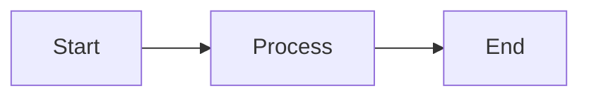
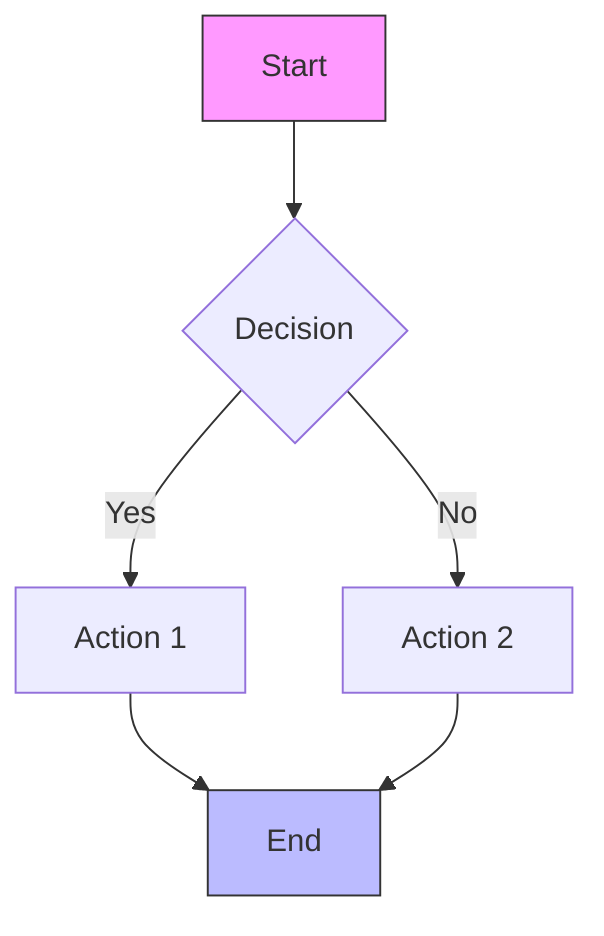
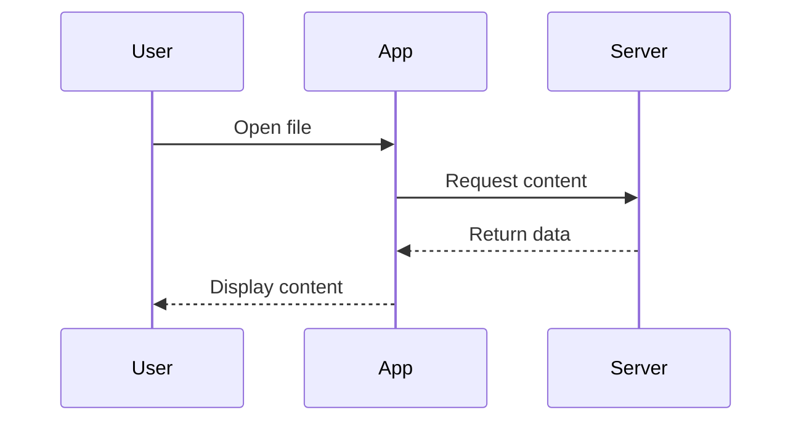
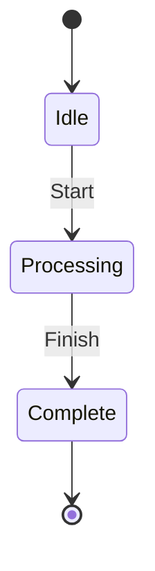

# Copy Features Edge Cases (Session 8)

## Copy Buttons on Code Blocks

### JavaScript Block
```javascript
// Hover to see copy button
const message = "Copy this code";
console.log(message);
```

### Python Block
```python
# Copy button should appear
def greet(name):
    return f"Hello, {name}!"
```

### SQL Block
```sql
-- Test copy functionality
SELECT * FROM users WHERE active = true;
```

### Empty Block (Should Still Have Copy Button)
```

```

### Single Line Block
```js
const x = 42;
```

### Very Long Block (Test Scrolling + Copy)
```javascript
function processLargeDataset(data) {
  const results = [];

  for (let i = 0; i < data.length; i++) {
    const item = data[i];

    if (item.valid && item.timestamp) {
      results.push({
        id: item.id,
        name: item.name,
        processed: true,
        timestamp: new Date(item.timestamp).toISOString(),
        metadata: {
          source: item.source || 'unknown',
          priority: item.priority || 0,
          tags: item.tags || [],
          nested: {
            deep: {
              value: "test"
            }
          }
        }
      });
    }
  }

  return results.sort((a, b) => b.metadata.priority - a.metadata.priority);
}
```

### Block with Special Characters (Test Clipboard Content)
```html
<div class="test" data-value="special&lt;&gt;&amp;&quot;">
  <!-- Comment with: <>&"' -->
  <script>console.log("test");</script>
</div>
```

### Multiple Consecutive Blocks
```python
# First block
print("Block 1")
```

```python
# Second block
print("Block 2")
```

```python
# Third block
print("Block 3")
```

## Mermaid Diagrams (Should NOT Have Copy Buttons)

### Simple Flowchart


### Complex Diagram


### Sequence Diagram


### State Diagram


## Context Menu (Right-Click Copy)

### Selectable Text Paragraph
This is a paragraph of text that should be selectable. Right-click on selected text to see "Copy" and "Copy as HTML" options in the context menu.

### Text with Formatting
This paragraph has **bold**, *italic*, ~~strikethrough~~, and `inline code` that should all be copyable with formatting preserved when using "Copy as HTML".

### Multiple Paragraphs
First paragraph with some text.

Second paragraph with more text.

Third paragraph to test multi-paragraph selection.

### Text with Links
Visit [GitHub](https://github.com) or check [Anthropic](https://anthropic.com) for more information. Selecting this text should allow copying with links preserved.

### List Items
- First list item
- Second list item with **bold**
- Third list item with [link](https://example.com)

### Blockquote Text
> This is quoted text that should be selectable.
>
> Second line of quote with *emphasis*.

### Table Content
| Column 1 | Column 2 |
|----------|----------|
| Data 1   | Data 2   |
| Data 3   | Data 4   |

Select table cells to test copy functionality.

## Edge Cases

### Copy from Mixed Content
This paragraph is followed by a code block:

```python
# Code block
print("test")
```

Select across both to test copy behavior.

### Copy from Nested Lists
- Level 1
  - Level 2 item with **bold**
    - Level 3 item with `code`

### Copy from Task Lists
- [x] Completed task (test copying checkbox state)
- [ ] Pending task (test copying unchecked state)

### Long Single Line (Horizontal Scroll + Copy)
```javascript
const veryLongVariableName = "This is an extremely long string that will cause horizontal scrolling in the code block and should still be copyable in its entirety without truncation when the copy button is clicked";
```

## Copy Button Positioning Tests

### Small Code Block (Button Should Fit)
```js
x = 1;
```

### Code Block at Page Edges
Scroll to the right edge of the window and verify copy button positioning:

```python
def edge_test():
    return "Test button position at window edge"
```

### Code Block After Heading

#### Small Heading
```python
print("After small heading")
```

## Rapid Copy Testing

Click these copy buttons in rapid succession:

```python
# Block 1
a = 1
```

```python
# Block 2
b = 2
```

```python
# Block 3
c = 3
```

```python
# Block 4
d = 4
```

```python
# Block 5
e = 5
```

## Copy Feedback

### Verify "Copied!" Message
1. Hover over code block
2. Click copy button
3. Verify "Copied!" text appears
4. Verify it disappears after ~2 seconds
5. Verify button returns to original state

### Test Multiple Copies
Copy this block multiple times to verify feedback resets:

```python
# Copy me multiple times
def test():
    return "multiple copy test"
```

## Integration with Theme

### Light Theme Code Block
Switch to light theme and verify copy button visibility:

```python
# Light theme test
print("Copy button should be visible")
```

### Dark Theme Code Block
Switch to dark theme and verify copy button visibility:

```python
# Dark theme test
print("Copy button should be visible")
```

## Accessibility

### Keyboard Navigation
Tab to code block and verify:
- Copy button is keyboard accessible
- Enter/Space triggers copy
- Focus visible on copy button

### Screen Reader
Copy button should have appropriate aria-label or title for screen readers.

## Performance

### Many Code Blocks
Test copy button performance with many blocks:

```python
# Block 1
```

```python
# Block 2
```

```python
# Block 3
```

```python
# Block 4
```

```python
# Block 5
```

```python
# Block 6
```

```python
# Block 7
```

```python
# Block 8
```

```python
# Block 9
```

```python
# Block 10
```
