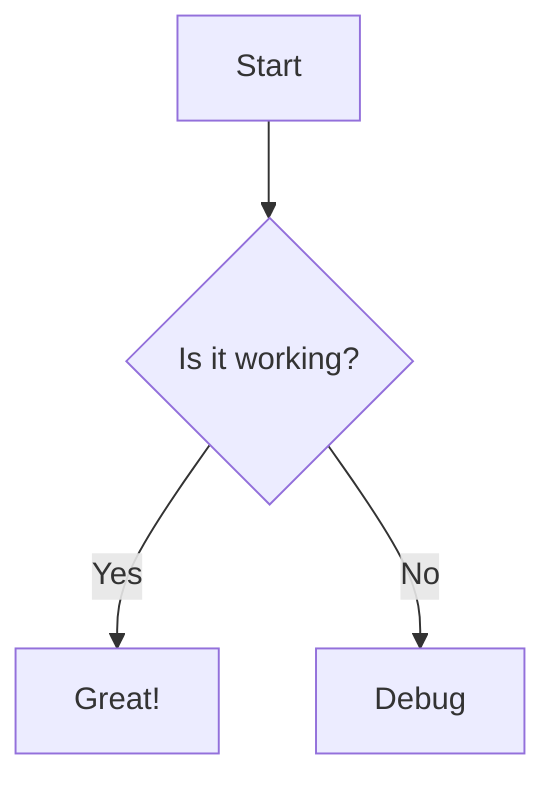

# Phase 1 Feature Test

Testing all Phase 1 internal parity features.

## Syntax Highlighting

JavaScript code with syntax highlighting:

```javascript
function hello_world() {
  const greeting = "Hello, World!";
  console.log(greeting);
  return greeting;
}
```

Python code:

```python
def fibonacci(n):
    if n <= 1:
        return n
    return fibonacci(n-1) + fibonacci(n-2)
```

## Linkify

Bare URLs should be auto-linked:
- https://github.com/starfysh-tech/markpane
- www.example.com

## Typographer

Test smart quotes: "Hello" and 'world'

Test em-dashes: This is an em-dash---see?

Test ellipses: Wait for it...

## Mermaid (should still work)



## Code without language label

This should render as plain text (no highlighting):

```
plain text code
no language specified
```
