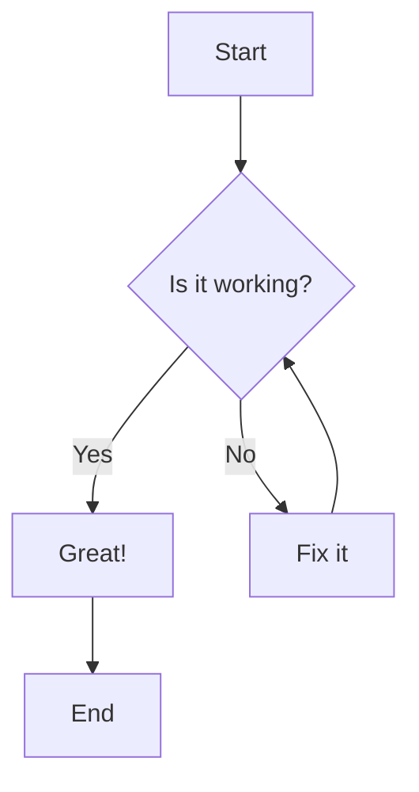
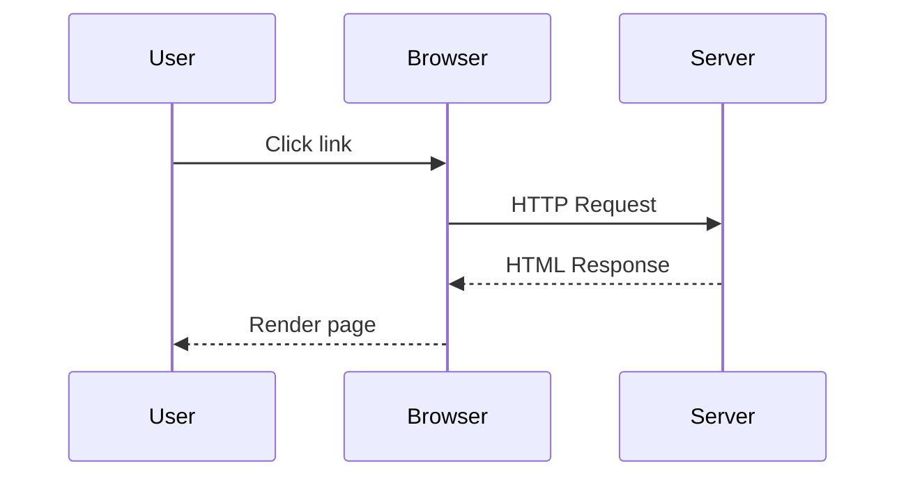

# Phase 1: Core Features Test

This file tests all Phase 1 features implemented in MarkPane.

## 1. Frontmatter Support

The frontmatter block above should be rendered in a styled section with:
- Dashed border
- Light background
- "Frontmatter" title
- All YAML content displayed

## 2. Syntax Highlighting

### JavaScript
```javascript
function fibonacci(n) {
  if (n <= 1) return n;
  return fibonacci(n - 1) + fibonacci(n - 2);
}

const result = fibonacci(10);
console.log(`Fibonacci(10) = ${result}`);
```

### Python
```python
def bubble_sort(arr):
    n = len(arr)
    for i in range(n):
        for j in range(0, n - i - 1):
            if arr[j] > arr[j + 1]:
                arr[j], arr[j + 1] = arr[j + 1], arr[j]
    return arr

numbers = [64, 34, 25, 12, 22, 11, 90]
sorted_numbers = bubble_sort(numbers)
print(f"Sorted: {sorted_numbers}")
```

### Rust
```rust
fn main() {
    let numbers = vec![1, 2, 3, 4, 5];
    let sum: i32 = numbers.iter().sum();
    println!("Sum: {}", sum);

    // Pattern matching
    match sum {
        15 => println!("Perfect sum!"),
        _ => println!("Different sum"),
    }
}
```

### SQL
```sql
SELECT
    users.name,
    COUNT(orders.id) as order_count,
    SUM(orders.total) as revenue
FROM users
LEFT JOIN orders ON users.id = orders.user_id
WHERE users.created_at > '2024-01-01'
GROUP BY users.id
HAVING order_count > 5
ORDER BY revenue DESC
LIMIT 10;
```

## 3. Linkify

### URLs should be automatically linked:

- https://github.com/anthropics/claude-code
- http://example.com/test?param=value
- www.google.com (should this be linked?)

### Email addresses:
- contact@example.com
- support@markpane.app

## 4. Typographer

### Smart Quotes
"This should use curly quotes" and 'these too'.

### Em Dashes
Use em dashes---like this---for parenthetical statements.

### Ellipsis
Trailing off...

### Replacements
- (c) → ©
- (tm) → ™
- (r) → ®
- +- → ±
- ... → …

## 5. Mermaid Diagrams

### Flowchart


### Sequence Diagram


## Expected Results

✅ Frontmatter displayed in styled section
✅ Code blocks have syntax highlighting
✅ URLs are clickable links
✅ Smart quotes replace straight quotes
✅ Em dashes render correctly
✅ Special replacements work (©, ™, ®, ±)
✅ Mermaid diagrams render correctly
✅ Light/dark theme affects code highlighting and mermaid
