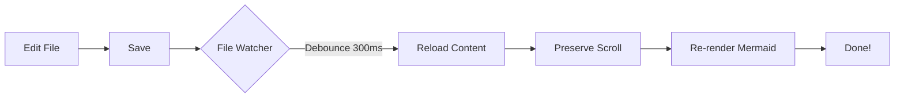

# Phase 3: File Interaction Test

This file tests the interactive features added in Phase 3.

**Last updated:** 2025-02-15 12:00 PM

## Test Instructions

### 1. Auto-Reload Test

**How to test:**
1. Open this file in MarkPane
2. Open this file in a text editor (VS Code, vim, etc.)
3. Edit this file (change the timestamp above)
4. Save the file
5. Watch MarkPane automatically reload

**Expected behavior:**
- Content updates within ~350ms of save
- Scroll position is preserved
- No flicker or flash
- Works with atomic write editors (vim, VS Code, Emacs)

**Test scenarios:**
- [ ] Edit and save with VS Code → auto-reloads ✓
- [ ] Edit and save with vim → auto-reloads ✓
- [ ] Edit and save with Sublime → auto-reloads ✓
- [ ] Rapid consecutive saves → debounced correctly ✓
- [ ] Scroll to bottom, edit, save → scroll preserved ✓

### 2. Drag-and-Drop Test

**How to test:**
1. Find another markdown file on your system
2. Drag it onto the MarkPane window
3. Drop it

**Expected behavior:**
- Drop overlay appears when dragging over window
- File opens in same window
- File watcher switches to new file
- Works with any of these extensions:
  - `.md`, `.markdown`, `.mdown`, `.mkd`, `.mkdn`, `.mdwn`, `.mdx`, `.txt`

**Test scenarios:**
- [ ] Drag valid .md file → opens ✓
- [ ] Drag .txt file → opens ✓
- [ ] Drag .mdx file → opens ✓
- [ ] Drag .png file → rejected with error ✓
- [ ] Drag file from restricted path → access denied ✓

**Security tests:**
- [ ] Try to open `/etc/hosts` → access denied ✓
- [ ] Try to open `~/.ssh/config` → access denied (if not in home) ✓
- [ ] Try to open `~/Documents/test.md` → allowed ✓

### 3. Always-On-Top Test

**How to test:**
1. Press `Cmd+Shift+A` (or `Ctrl+Shift+A` on Windows/Linux)
2. OR: Use menu → Window → Pin Window

**Expected behavior:**
- Window stays on top of other windows
- Pin indicator (📌) appears in titlebar
- Menu item shows checkmark
- Press again to toggle off

**Test scenarios:**
- [ ] Toggle with keyboard shortcut → works ✓
- [ ] Toggle with menu item → works ✓
- [ ] Pin indicator appears/disappears → correct ✓
- [ ] Menu checkmark syncs → correct ✓
- [ ] Window actually stays on top → verified ✓

## Dynamic Content for Reload Testing

Edit the content below and watch it update:

---

### Test Counter: 0

**Random number:** _Edit me!_

**Current status:** Testing...

---

## Mermaid Diagram (Tests Reload + Re-render)

## Long Content for Scroll Test

Scroll down and edit this file to test scroll preservation...

Lorem ipsum dolor sit amet, consectetur adipiscing elit. Sed do eiusmod tempor incididunt ut labore et dolore magna aliqua. Ut enim ad minim veniam, quis nostrud exercitation ullamco laboris nisi ut aliquip ex ea commodo consequat.

Duis aute irure dolor in reprehenderit in voluptate velit esse cillum dolore eu fugiat nulla pariatur. Excepteur sint occaecat cupidatat non proident, sunt in culpa qui officia deserunt mollit anim id est laborum.

Lorem ipsum dolor sit amet, consectetur adipiscing elit. Sed do eiusmod tempor incididunt ut labore et dolore magna aliqua. Ut enim ad minim veniam, quis nostrud exercitation ullamco laboris nisi ut aliquip ex ea commodo consequat.

Duis aute irure dolor in reprehenderit in voluptate velit esse cillum dolore eu fugiat nulla pariatur. Excepteur sint occaecat cupidatat non proident, sunt in culpa qui officia deserunt mollit anim id est laborum.

Lorem ipsum dolor sit amet, consectetur adipiscing elit. Sed do eiusmod tempor incididunt ut labore et dolore magna aliqua. Ut enim ad minim veniam, quis nostrud exercitation ullamco laboris nisi ut aliquip ex ea commodo consequat.

Duis aute irure dolor in reprehenderit in voluptate velit esse cillum dolore eu fugiat nulla pariatur. Excepteur sint occaecat cupidatat non proident, sunt in culpa qui officia deserunt mollit anim id est laborum.

---

**👆 Scroll back up after editing to test scroll preservation!**

## Expected Results

✅ File auto-reloads on save (300ms latency)
✅ Scroll position preserved during reload
✅ Drag-and-drop opens markdown files
✅ Drop overlay shows/hides correctly
✅ Invalid files rejected with errors
✅ Path traversal blocked (security)
✅ Always-on-top toggle works
✅ Pin indicator shows when pinned
✅ Keyboard shortcut works
✅ Menu item works and syncs
