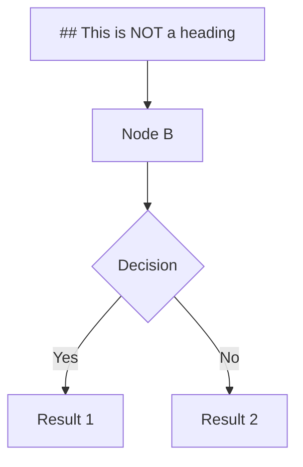

# Phase 4: Navigation & Search Test

Test file for TOC sidebar, find-in-page, and keyboard shortcuts.

**Last updated:** 2026-02-15

## Test Cases

### 1. Basic Headings

#### Subheading Level 2

##### Subheading Level 3

###### Subheading Level 4

### 2. Duplicate Headings (ID Collision Test)

## Introduction

Some content here.

## Introduction

Duplicate heading - should get `user-content-introduction-1` ID.

## Introduction

Third duplicate - should get `user-content-introduction-2` ID.

### 3. Long Heading Text (Truncation Test)

## This is a very long heading that should be truncated with ellipsis after a certain width in the TOC sidebar but the full text should be visible on hover and the ID should not be truncated

Content under long heading.

### 4. Task-List Checkboxes in Headings

## [x] Completed Feature

This heading has a checkbox that should be stripped from TOC text.

### [ ] Pending Task

Another heading with checkbox.

## ~~Old~~ New Approach (Strikethrough Test)

Strikethrough should be handled correctly in TOC.

### 5. Code Spans in Headings

## API Reference: `fetch()` Method

## The `async`/`await` Pattern

Code spans should appear in TOC.

### 6. Special Characters in Headings

## Hello & Goodbye

## Hello, World!

## Test #1: Numbers & Symbols

## <script>alert('XSS')</script>

HTML in heading should be sanitized.

### 7. Unicode and Emoji Tests

## Café

## 你好 (Chinese)

## Привет (Russian)

## 😄 Emoji Test

## Côte d'Ivoire

### 8. Empty Sections

## Section with No Content

## Another Empty Section

### 9. Nested Lists and Content

## Complex Content Section

Content with:

- Bullet points
  - Nested items
  - More nesting
- More bullets

### Task lists:
- [ ] Unchecked
- [x] Checked

### Code blocks:
```javascript
const test = 'code block';
```

### 10. Mermaid Diagram Test



The `## This is NOT a heading` text inside mermaid should not appear in TOC.

## Performance Test Section

<!-- Auto-generated headings for performance testing -->

### Heading 1
Content 1

### Heading 2
Content 2

### Heading 3
Content 3

### Heading 4
Content 4

### Heading 5
Content 5

### Heading 6
Content 6

### Heading 7
Content 7

### Heading 8
Content 8

### Heading 9
Content 9

### Heading 10
Content 10

### Heading 11
Content 11

### Heading 12
Content 12

### Heading 13
Content 13

### Heading 14
Content 14

### Heading 15
Content 15

### Heading 16
Content 16

### Heading 17
Content 17

### Heading 18
Content 18

### Heading 19
Content 19

### Heading 20
Content 20

## Edge Cases Summary

This file tests:
- ✅ Multiple heading levels (H1-H6)
- ✅ Duplicate headings (ID collision)
- ✅ Long heading text (truncation)
- ✅ Task-list checkboxes in headings
- ✅ Strikethrough in headings
- ✅ Code spans in headings
- ✅ Special characters & HTML
- ✅ Unicode text (multiple languages)
- ✅ Emoji in headings
- ✅ Empty sections
- ✅ Mermaid diagrams (heading-like text)
- ✅ Performance test (20+ headings)

## Expected Behavior

### TOC Extraction
- All `##` headings should appear in TOC
- Checkboxes should be stripped from TOC text
- IDs should be `user-content-{slug}` format
- Duplicates should have `-1`, `-2` suffixes
- HTML should be sanitized
- Unicode should be preserved
- Mermaid content should NOT appear in TOC

### Keyboard Navigation
- `Cmd+Shift+O`: Toggle TOC
- `Cmd+F`: Find in page
- Arrow keys: Navigate TOC
- Enter/Space: Expand/collapse
- Home/End: Jump to first/last

### Scroll Tracking
- Active heading should highlight as you scroll
- TOC should scroll to show active heading
- Smooth 60 FPS scrolling

### Accessibility
- Screen reader announces headings
- Focus visible on all items
- Roving tabindex pattern
- ARIA attributes present
