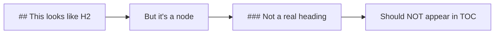

# Phase 4: Navigation & Search Test

This file tests all Phase 4 features: find-in-page, table of contents, and keyboard shortcuts.

**Last updated:** 2026-02-15

---

## Test Objectives

- [ ] Find in page (Cmd+F)
- [ ] TOC extraction from headings
- [ ] TOC sidebar toggle (Cmd+Shift+O)
- [ ] Keyboard navigation in TOC
- [ ] Active heading tracking
- [ ] State persistence
- [ ] Theme compatibility

---

## Section 1: Basic Headings

### Subsection 1.1: Introduction

This is a simple subsection to test basic TOC extraction.

### Subsection 1.2: Getting Started

Multiple headings at the same level should all appear in the TOC.

#### Subsection 1.2.1: Deep Nesting

Testing deeply nested headings (H4 level).

##### Subsection 1.2.1.1: Very Deep (H5)

Even deeper nesting.

###### Subsection 1.2.1.1.1: Maximum Depth (H6)

This is the deepest heading level in markdown.

---

## Section 2: Duplicate Headings

### Introduction

This is a duplicate "Introduction" heading - should get unique ID.

### Introduction

Third "Introduction" heading - should get unique ID with suffix.

### Setup

First setup section.

### Setup

Duplicate setup section.

### Configuration

Config section.

### Configuration

Duplicate config section.

---

## Section 3: Special Characters

### Hello & Goodbye

Testing ampersand in heading.

### Hello, World!

Testing punctuation.

### <script>alert('XSS')</script>

Testing HTML injection attempt - should be sanitized.

### [Link Text](https://example.com)

Testing markdown link syntax in heading.

### Code: `fetch()` Method

Testing inline code in heading.

---

## Section 4: Unicode and Emoji

### Café

French accented character.

### 你好世界

Chinese characters.

### Привет мир

Cyrillic characters.

### 😄 Emoji Test

Emoji in heading (should be stripped from ID but visible in text).

### مرحبا بالعالم

Arabic text (right-to-left).

---

## Section 5: Task Lists in Headings

### [x] Completed Feature

Heading with checked task list item.

### [ ] Pending Task

Heading with unchecked task list item.

### ~~Old~~ New Approach

Heading with strikethrough text.

---

## Section 6: Very Long Headings

### This is a very long heading that should be truncated with ellipsis after a certain width in the TOC sidebar but the full text should be visible on hover when the user mouses over the truncated heading in the table of contents

Testing heading truncation with ellipsis.

### Another extremely long heading text to test how the TOC handles wrapping and truncation when headings exceed the maximum display width for the sidebar which is currently set to 250 pixels

Another long heading.

---

## Section 7: Empty Sections

### Empty Section 1

### Empty Section 2

### Empty Section 3

---

## Section 8: Code Blocks

Some code for find-in-page testing:

```javascript
function example() {
  console.log('Hello, world!');
  return 42;
}
```

```python
def greet(name):
    print(f"Hello, {name}!")
    return True
```

---

## Section 9: Mermaid Diagrams



The mermaid diagram above contains heading-like text that should **not** appear in the TOC.

---

## Section 10: Mixed Content

### Testing Multiple Features

This section tests:
- Find in page: Search for "unique-keyword-12345"
- TOC extraction: Should appear in TOC
- Scrolling: Should highlight when scrolled into view
- Keyboard nav: Should be reachable with arrow keys

unique-keyword-12345

---

## Performance Test Headings

Below are auto-generated headings for performance testing with 50+ headings:

### Heading 001
Content for heading 001.

### Heading 002
Content for heading 002.

### Heading 003
Content for heading 003.

### Heading 004
Content for heading 004.

### Heading 005
Content for heading 005.

### Heading 006
Content for heading 006.

### Heading 007
Content for heading 007.

### Heading 008
Content for heading 008.

### Heading 009
Content for heading 009.

### Heading 010
Content for heading 010.

### Heading 011
Content for heading 011.

### Heading 012
Content for heading 012.

### Heading 013
Content for heading 013.

### Heading 014
Content for heading 014.

### Heading 015
Content for heading 015.

### Heading 016
Content for heading 016.

### Heading 017
Content for heading 017.

### Heading 018
Content for heading 018.

### Heading 019
Content for heading 019.

### Heading 020
Content for heading 020.

### Heading 021
Content for heading 021.

### Heading 022
Content for heading 022.

### Heading 023
Content for heading 023.

### Heading 024
Content for heading 024.

### Heading 025
Content for heading 025.

### Heading 026
Content for heading 026.

### Heading 027
Content for heading 027.

### Heading 028
Content for heading 028.

### Heading 029
Content for heading 029.

### Heading 030
Content for heading 030.

### Heading 031
Content for heading 031.

### Heading 032
Content for heading 032.

### Heading 033
Content for heading 033.

### Heading 034
Content for heading 034.

### Heading 035
Content for heading 035.

### Heading 036
Content for heading 036.

### Heading 037
Content for heading 037.

### Heading 038
Content for heading 038.

### Heading 039
Content for heading 039.

### Heading 040
Content for heading 040.

### Heading 041
Content for heading 041.

### Heading 042
Content for heading 042.

### Heading 043
Content for heading 043.

### Heading 044
Content for heading 044.

### Heading 045
Content for heading 045.

### Heading 046
Content for heading 046.

### Heading 047
Content for heading 047.

### Heading 048
Content for heading 048.

### Heading 049
Content for heading 049.

### Heading 050
Content for heading 050.

---

## Expected Results

### TOC Extraction
- ✅ All H1-H6 headings extracted
- ✅ Task-list checkboxes stripped from heading text
- ✅ Duplicate headings have unique IDs
- ✅ Special characters sanitized
- ✅ Unicode headings preserved
- ✅ Mermaid diagram text NOT extracted

### Find in Page
- ✅ Cmd+F opens find dialog
- ✅ Search highlights matches
- ✅ Navigate with Enter/Shift+Enter
- ✅ Mermaid error divs excluded

### Keyboard Navigation
- ✅ Cmd+Shift+O toggles TOC
- ✅ Arrow keys navigate TOC
- ✅ Home/End jump to first/last
- ✅ Enter/Space expand/collapse

### Performance
- ✅ 50+ headings render smoothly
- ✅ Scroll tracking at 60 FPS
- ✅ No memory leaks on file reload

### State Persistence
- ✅ Collapsed sections persist across reloads
- ✅ State saved to userData/toc-state.json

### Theme Compatibility
- ✅ TOC visible in light mode
- ✅ TOC visible in dark mode
- ✅ Focus ring visible in both themes
- ✅ Active heading visible in both themes
